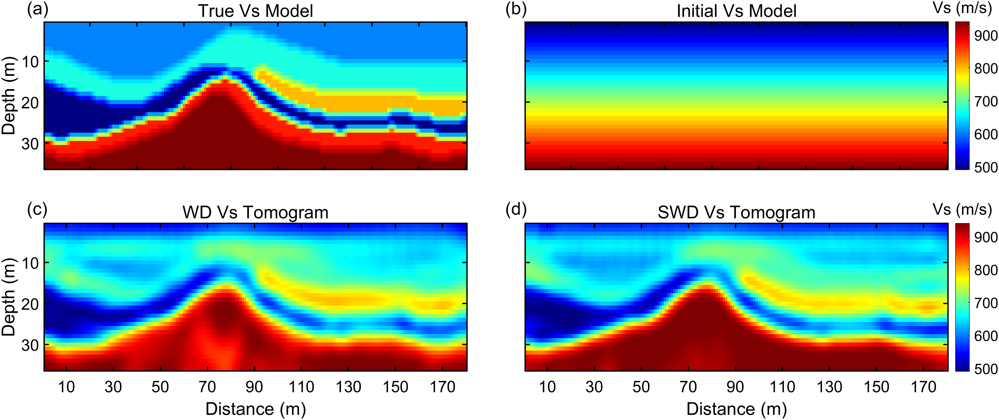

# Skeletonized Wave-Equation Dispersion Spectrum Inversion (SWD)

## Description
Skeletonized Wave-Equation Dispersion Spectrum Inversion (SWD), is a novel approach in geophysical research aimed at obtaining a robust and reliable near-surface S-wave velocity structure. This novel method leverages a skeletal inversion framework that eschews traditional full waveform inversion's susceptibility to cycle-skipping by implementing a smooth gradient approximation between the dispersion spectrum and the misfit function. This is achieved through the SoftMax approximation.

The technique innovatively derives the gradient of the misfit function with respect to the velocity model utilizing the chain rule and adjoint state method. This integration allows SWD to couple with the wave equation, enabling precise and stable S-wave velocity inversions. Unlike conventional methods, SWD does not depend on a layered assumption, thus enhancing lateral resolution significantly.

SWD capitalizes on the concept of skeletonizing complex surface wave arrivals into simpler forms—specifically, picked dispersion curves in the phase-velocity and frequency domains, akin to wave-equation traveltime tomography. These dispersion curves are primarily obtained from Rayleigh waves captured by vertical-component geophones. The misfit function itself is defined as the sum of the squared differences between the wavenumbers of the predicted and observed dispersion curves, reflecting the method's refined approach to accurately capturing subsurface velocity structures.

## Key Features
- **Multi-offset Method**: Utilizes a sequence from long to short offsets, updating long-wavelength information prior to shorter wavelengths, which enhances the inversion's effectiveness.
- **C++ Acceleration**: Employs C++ for the acceleration of finite difference forward and inverse kernels, greatly enhancing computational efficiency.
- **Elastic Wave Flat Surface Conditions**: Optimized for environments typical of elastic wave propagation over flat terrains, ensuring reliable and detailed analysis.
- **Linear Radon Transform**: Uses the Linear Radon Transform for efficient extraction of dispersion curves, significantly improving the accuracy of phase velocity and frequency analysis.

## Usage
run SWD.m

## Result

## License
SWD is distributed under the GNU General Public License v3.0. See the `LICENSE` file for more details.

## Contact
- **Zhang Chang**: zhangchang23@mails.jlu.edu.cn
- **Li Jing**: jing.li@kaust.edu.sa

## Citation
If you use this package in your own research, please cite the following papers:

- Zhang, C., J. Li, and H. Cao, 2024, Skeletonized wave-equation dispersion spectrum inversion: GEOPHYSICS (under review)